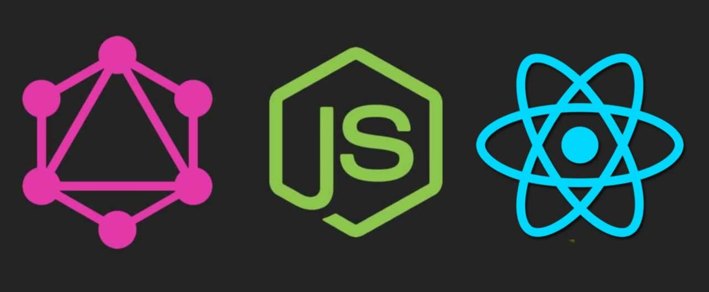
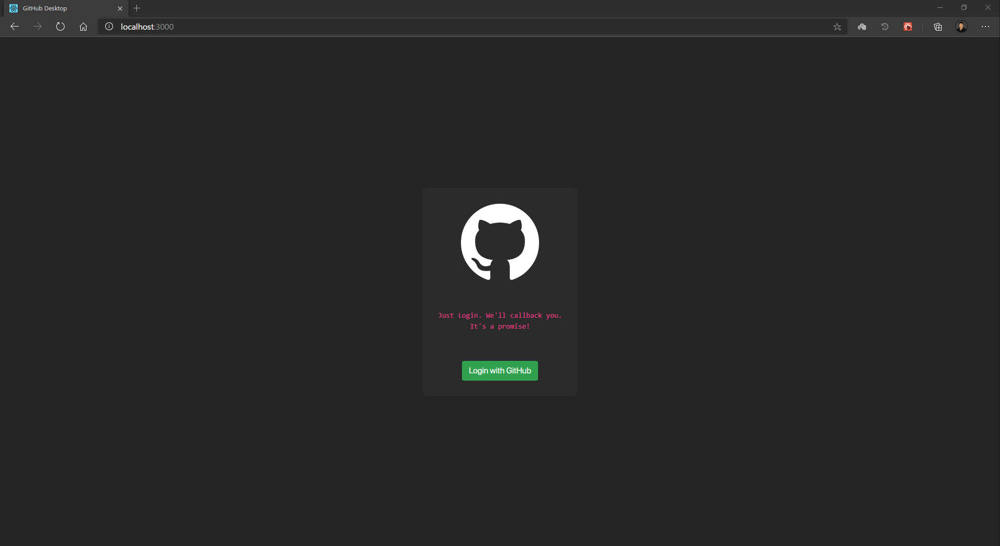
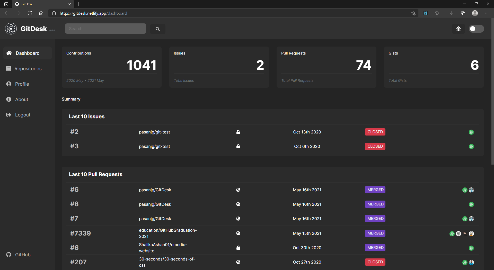
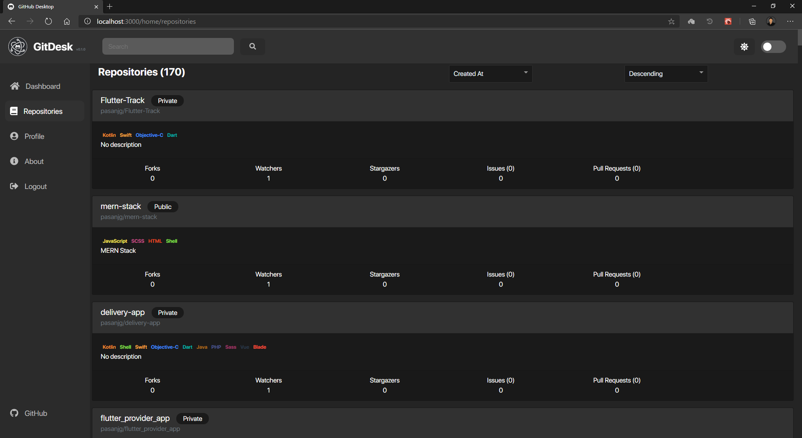
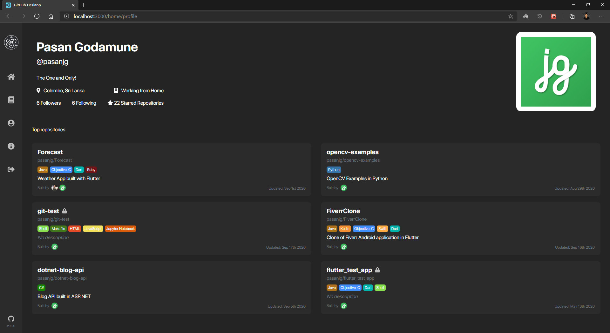

<div align="center">

<!-- [![Build Status][github-actions-status]][github-actions-url] -->
<!-- [![Netlify Status][netlify-status]][netlify-url] -->
<!-- [![Github Tag][github-tag-image]][github-tag-url] -->
[![Vercel][vercel-badge]][vercel-url]

</div>
<br/>

GitHub Client application built with React using the GitHub [GraphQL API](https://docs.github.com/en/free-pro-team@latest/graphql)

OAuth is deployed on [Vercel](https://gitdesk.vercel.app)

Authorization Token is retreived from `https://gitdesk.vercel.app/authenticate/:code`

## Install

Clone the repo and install dependencies:

```bash
$ git clone https://github.com/pasanjg/GitDesk.git
$ cd GitDesk
$ npm install
```

## Starting Development

```bash
npm start
```

## Screenshots

- ##### Login

- ##### Dashboard

- ##### Repositories

- ##### Profile



## License

[MIT][license-url]


[github-actions-status]: https://github.com/pasanjg/GitHub-Desktop/workflows/CI/badge.svg
[github-actions-url]: https://github.com/pasanjg/GitHub-Desktop/actions
[netlify-status]: https://api.netlify.com/api/v1/badges/df5b1dc3-2eb3-466d-bf89-1a5a5e443c44/deploy-status
[netlify-url]: https://gitdesk.netlify.app/
[vercel-url]: https://gitdesk.vercel.app/
[vercel-badge]: https://img.shields.io/badge/deployed-brightgreen?style=for-the-badge&logo=vercel&label=vercel&labelColor=grey&color=brightgreen&link=https%3A%2F%2Fgitdesk.vercel.app
<!-- [github-tag-image]: https://img.shields.io/github/tag/pasanjg/GitHub-Desktop.svg?label=version
[github-tag-url]: https://github.com/pasanjg/GitHub-Desktop/releases/latest -->
[license-url]: https://github.com/pasanjg/GitHub-Desktop/blob/master/LICENSE
